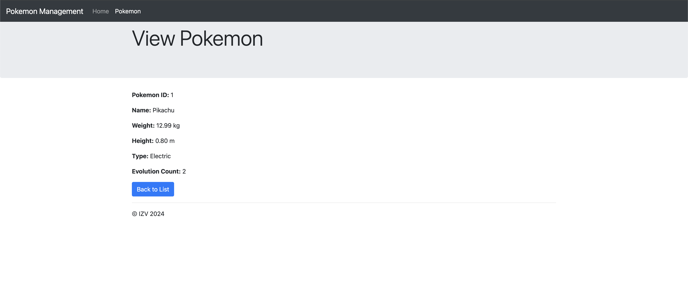

# Pokémon Management PHP App

This application allows users to manage a Pokémon database, including creating, editing, viewing, and deleting Pokémon.

## Features

- **Login**: Users can log in to manage Pokémon.
- **Pokémon Management**: Users can add, edit, view, and delete Pokémon.
- **Database**: Pokémon data is stored in a MySQL database.
- **Data Validation**: Input data validation to ensure database integrity.

## Installation

1. Clone the repository:
    ```bash
    git clone git@github.com:davidrivasrodriguez/pokemons-php.git
    ```
2. Navigate to the project directory:
    ```bash
    cd your-repository
    ```
3. Set up the MySQL database using the `database.sql` file.
4. Configure the `config.php` file with your database credentials.

## Usage
1. Log in through the user interface.
2. Manage Pokémon (add, edit, view, delete) through the user interface.

## Screenshots


